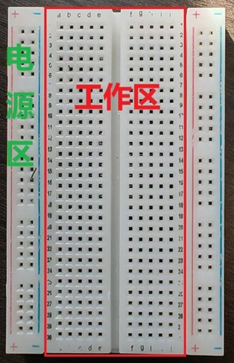
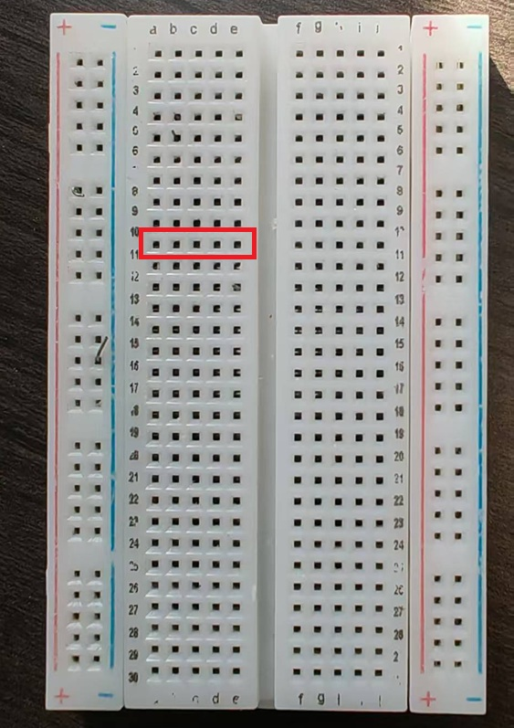
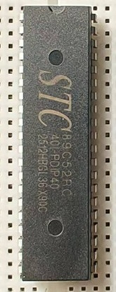

# 燕之波--插线板指南针制作教程

>本教程将指导你如何利用简单材料制作一个简易的插线板指南针。
---
## 目录

## 说明：

- 指南针元器件请参考[材料清单](./材料.md)。
- 杜邦线的端头有两种规格，尖与孔。将尖插入面包板的引脚孔，将孔与元器件引脚相连，即为将元器件与面包版连接。
- 杜邦线插入面包板时，可能有接触不良的现象，可以选择在插入的引脚孔中插入一根短的铁丝，增加接触面积
- 单片机通过面包板与其余元器件相连接，面包板分为电源区与主工作区（如左图），主工作区分左右两半互不相连，但每半扇工作区的每排引脚孔相连（如右图中红框选中的引脚孔）。当不同元器件通过杜邦线插入同一半工作区的同一排引脚孔，即视为相连。
    

### 单片机引脚示意图

 - 用于后续单片机与其他元器件引脚连接时对照。左图是示意图，右图为实物图，注意半圆缺口方向向上。
   
  
  
### 指南针的硬件安装

#### 底座的处理

1. 将单片机放置于面板板上，引脚插入孔中，位置尽量居中

2. 由于面包板左右电极不互通，而我们只给一侧接通电源，故用两根杜邦线（两端为尖）将左右的正级与正极，负极与负极相连。红线两端表示连接位置

#### 元器件的安装

1. 首先放置数字罗盘传感器，传感器内部有磁阻元件，能测量三个维度（X、Y、Z轴）的磁场强度，并将这些物理量转换为电信号。我们需要用到传感器上的VCC（电源），GND（地线），SCL（串行时钟线），SDA（串行数据线）这四个引脚。这四个引脚按照下表方式与单片机或面包板相连：
   
|传感器引脚|单片机引脚/面包板|
|:---:|:---:|
VCC|面包板正极
GND|面包板负极
SCL|单片机P1.0
SDA|单片机P1.1

   以下是示例图

   
/*根据单片机引脚示意图，在面包板上找到其所在位置，将传感器的引脚通过杜邦线接入同一排引脚孔即可*/

2. 接下来连接LED显示屏，主要用于显示传感器所指向的方位，并以数字显示。此处需要连接8个引脚,如下表格所示
   
|显示器引脚|单片机引脚|
|:---:|:---:|
GND|P2.5
UCC|P2.5
SCL|RST
SDA|P1.5
RES|T1
DC|P1.2
CS|P1.3
BLK|T0

3. 连接晶振，晶振主要为单片机提供时钟信号。晶振两个引脚没有方向区分，分别连接单片机的XTAL1、XTAL2引脚即可。

4. 连接转换器，USB与TTL接口的信号转换。TXD是输出数据，RXD是输入数据，故应将不同元器件的TXD与RXD相连。具体连接如下表

 |转换器引脚|单片机引脚|  
 |:---:|:---:|  
 VCC|VCC  
 GND|GND  
 TXD|RXD  
 RXD|TXD  

5. 放置电阻，用于拉高电平。电阻无方向。连接方式如下表：

 |电阻引脚|单片机引脚|  
 |:---:|:---:| 
 电阻A任意引脚|面包板正极
 电阻A另一引脚|P1.0
 电阻B任意引脚|面包板正极
 电阻B另一引脚|P1.1
 

___
## 制作步骤

### 1. 硬件连接
STC 89C52RC单片机直接插在面包板上，尽量居中  
其余元器件都依次放置到面包板上，通过面包板与单片机连接，主要注意元器件引脚与单片机引脚正确连接。

 
*这是一个STC 89C52RC单片机的引脚示意图，注意方向*

**晶振**: 晶振的两个引脚，即与单片机左侧第18、19行引脚相连

*以此为例，不同元器件引脚处于同一行即连接，如图黄线所示*

**LED显示屏**:  
|显示器引脚|单片机引脚|
|:---:|:---:|
GND|P2.5
UCC|P2.5
SCL|RST
SDA|P1.5
RES|T1
DC|P1.2
CS|P1.3
BLK|T0

**数字罗盘传感器模块**:  
-传感器的SDA引脚与单片机P1.1连接   
-传感器的SCL引脚与单片机P1.0连接  

 **串行转换器**  
-转换器的VCC引脚与单片机VCC连接  
-转换器的GND引脚与单片机GND连接  
-转换器的TXD引脚与单片机RXD连接  
-转换器的RXD引脚与单片机TXD连接  
*TXD和RXD分别是传输数据与接收数据，A传输数据B就接收数据，所以必须是TXD与RXD相连*  
___

## 原理说明

通过数字罗盘传感器感知地球磁场。这个传感器内部有磁阻元件，能测量三个维度（X、Y、Z轴）的磁场强度，并将这些物理量转换为电信号。由 STC 单片机来接收和处理这些电信号。单片机内部运行着烧录的程序代码，这段代码会执行以下操作：时钟同步、数据读取、方位计算。

## 成果展示

 

