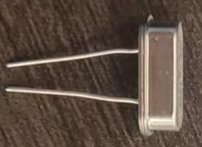

# 燕之波--插板指南针制作指南

本教程将指导你如何利用简单材料制作一个简易的插板式指南针。

## 材料准备

制作前，请准备好以下材料：

- **STC89C52RC单片机**: 处理数据，执行程序，控制输出
-

- **面包板**: 临时电路搭建平台
-  
- **LED显示屏**: 负责输出结果
- 

- **数字罗盘传感器模块**: 型号HW-245，可以测量三个维度（X、Y、Z轴）的磁场强度并转换为数字信号。
-  

- **晶振**: 提供精确的、稳定的时钟信号，本次实验采用8.000 MHz频率的晶振
-  

- 
- **辅助工具**: 若干电线，电阻

## 制作步骤

### 1. 硬件连接
 
 
*这是一个STC 89C52RC单片机的引脚示意图*

**测试是否成功**: 磁化后的针应能吸引另一根针或细小的铁屑。

### 2. 制作指针与浮台
- 取一小块泡沫塑料，修剪成指甲盖大小
- 将磁化后的针**水平**穿过浮台材料

### 3. 组装与调试
- 将浮台轻轻放入盛有水的碗中
- 等待其静止，针会指向**南北方向**
- 用商用指南针对比，确定北极和南极

## 原理说明

地球本身就是一个巨大的磁体，拥有磁场。磁化后的针会受到地磁场的力矩作用，从而旋转至与地磁感线方向一致。

## 注意事项

- 磁化后的针要避免剧烈撞击或高温加热
- 实验时请**远离**强大的磁场环境
- **儿童请在成人监护下操作**
