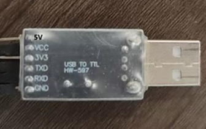

# 燕之波--插板指南针制作教程

### 目录
* [材料准备](#材料准备)
* [制作步骤](#制作步骤)
    * [1. 硬件连接](#1-硬件连接)
    * [2. 软件下载](#2-软件下载)
    * [3. 程序烧录](#3-程序烧录)
* [原理说明](#原理说明)
* [成果展示](#成果展示)

---

本教程将指导你如何利用简单材料制作一个简易的插板式指南针。
本教程将指导你如何利用简单材料制作一个简易的插板式指南针。
___
## 材料准备

|元器件|规格|数量| |
|:---|:---:|---:|:---:|
单片机|SRC89C52RC|一个||
LED显示屏| |一块||
数字罗盘传感模块|HW-246/GY-271|一个||
电阻|1.52kΩ|两个|
杜邦线|AWG22|若干|
面包板|400孔|一个||
转换接头|HW-597|一个||
晶振|8kHZ|一个||

制作前，请准备好以下材料：

- **STC89C52RC单片机**: 处理数据，执行程序，控制输出
 
- 

- **面包板**: 临时电路搭建平台
 
-  
  
- **LED显示屏**: 负责输出结果
 
- 
 
- **数字罗盘传感器模块**: 型号HW-245，可以测量三个维度（X、Y、Z轴）的磁场强度并转换为数字信号。

-  

- **晶振**: 提供精确的、稳定的时钟信号，本次实验采用8.000 MHz频率的晶振

-  

- **串行转换器**用于烧录程序，与USB转接TTL
  
-  
 
- **辅助工具**: 若干电线，电阻
___
## 制作步骤

### 1. 硬件连接
STC 89C52RC单片机直接插在面包板上，尽量居中  
其余元器件都依次放置到面包板上，通过面包板与单片机连接，主要注意元器件引脚与单片机引脚正确连接。

 
 
*这是一个STC 89C52RC单片机的引脚示意图，注意方向*

**晶振**: 晶振的两个引脚与单片机的XTAL1、XTAL2引脚连接，即与单片机左侧第18、19行引脚相连

 

*以此为例，不同元器件引脚处于同一行即连接，如图黄线所示*

**LED显示屏**:  
-显示屏的GND、UCC引脚与单片机P2.5连接  
-显示屏的SCL引脚与单片机RST相连  
-显示屏的SDA引脚与单片机P1.5相连  
-显示屏的RES引脚与单片机T1相连  
-显示屏的DC引脚与单片机P1.2相连  
-显示屏的CS引脚与单片机P1.3相连  
-显示屏的BLK引脚与单片机T0相连  

**数字罗盘传感器模块**:  
-传感器的SDA引脚与单片机P1.1连接   
-传感器的SCL引脚与单片机P1.0连接  

 **串行转换器**  
-转换器的VCC引脚与单片机VCC连接  
-转换器的GND引脚与单片机GND连接  
-转换器的TXD引脚与单片机RXD连接  
-转换器的RXD引脚与单片机TXD连接  
*TXD和RXD分别是传输数据与接收数据，A传输数据B就接收数据，所以必须是TXD与RXD相连*  
___

## 原理说明

通过数字罗盘传感器感知地球磁场。这个传感器内部有磁阻元件，能测量三个维度（X、Y、Z轴）的磁场强度，并将这些物理量转换为电信号。由 STC 单片机来接收和处理这些电信号。单片机内部运行着烧录的程序代码，这段代码会执行以下操作：时钟同步、数据读取、方位计算。

## 成果展示

 

