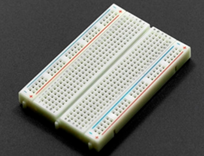

# 燕之波--插板指南针制作教程

本教程将指导你如何利用简单材料制作一个简易的插板式指南针。
___
## 材料准备

制作前，请准备好以下材料：

- **STC89C52RC单片机**: 处理数据，执行程序，控制输出
 
- 

- **面包板**: 临时电路搭建平台
 
-  
  
- **LED显示屏**: 负责输出结果
 
- 
 
- **数字罗盘传感器模块**: 型号HW-245，可以测量三个维度（X、Y、Z轴）的磁场强度并转换为数字信号。

-  

- **晶振**: 提供精确的、稳定的时钟信号，本次实验采用8.000 MHz频率的晶振

-  

- **串行转换器**用于烧录程序，与USB转接TTL
  
-  
 
- **辅助工具**: 若干电线，电阻
___
## 制作步骤

### 1. 硬件连接
STC 89C52RC单片机直接插在面包板上，尽量居中  
其余元器件都依次放置到面包板上，通过面包板与单片机连接，主要注意元器件引脚与单片机引脚正确连接。

 
 
*这是一个STC 89C52RC单片机的引脚示意图，注意方向*

**晶振**: 晶振的两个引脚与单片机的XTAL1、XTAL2引脚连接，即与单片机左侧第18、19行引脚相连

 

*以此为例，不同元器件引脚处于同一行即连接，如图黄线所示*

**LED显示屏**:  
-显示屏的GND、UCC引脚与单片机P2.5连接  
-显示屏的SCL引脚与单片机RST相连  
-显示屏的SDA引脚与单片机P1.5相连  
-显示屏的RES引脚与单片机T1相连  
-显示屏的DC引脚与单片机P1.2相连  
-显示屏的CS引脚与单片机P1.3相连  
-显示屏的BLK引脚与单片机T0相连  

**数字罗盘传感器模块**:  
-传感器的SDA引脚与单片机P1.1连接   
-传感器的SCL引脚与单片机P1.0连接  

 **串行转换器**  
-转换器的VCC引脚与单片机VCC连接  
-转换器的GND引脚与单片机GND连接  
-转换器的TXD引脚与单片机RXD连接  
-转换器的RXD引脚与单片机TXD连接  
___
### 2. 软件下载
- 需要先下载Keil 5与stc-isp两款软件，才能进行程序烧录
- 点击这里访问[教程](https://www.bilibili.com/video/BV1Mb411e7re/?spm_id_from=333.337.search-card.all.click&vd_source=6fab490cb0a2845d28aa2ad7d5a10c4b)。

- 点击这里下载[软件](https://jiangxiekeji.com/download.html)。
  
- 点击这里下载[程序]()。
___
### 3. 程序烧录
- 打开stc软件，修改下图中画横线的地方  
  型号改成你所用单片机型号，串口号会自动识别，打开程序文件即为上述下载的文件。然后点击下载/编程。

 

## 原理说明

地球本身就是一个巨大的磁体，拥有磁场。磁化后的针会受到地磁场的力矩作用，从而旋转至与地磁感线方向一致。

## 注意事项

- 磁化后的针要避免剧烈撞击或高温加热
- 实验时请**远离**强大的磁场环境
- **儿童请在成人监护下操作**
