# 北极星--插线板指南针制作教程

>
---

## 目录
- [一、项目介绍](#一项目介绍)
- [二、材料清单](#二材料清单)
- [三、前驱知识——元器件与软件介绍](#三前驱知识元器件与软件介绍)
  - [1.晶振](#1晶振)
  - [2.传感器](#2传感器)
  - [3.显示屏](#3显示屏)
  - [4.杜邦线](#4杜邦线)
  - [5.转换头](#5转换头)
  - [6.面包板](#6面包板)
  - [7.单片机](#7单片机)
- [四、指南针的安装与检验](#四指南针的安装与检验)
  - [1.最小系统电路板的安装](#1最小系统电路板的安装)
    - [(1)放置单片机与连通面包板](#1放置单片机与连通面包板)
    - [(2)连接晶振](#2连接晶振)
    - [(3)连接转换器](#3连接转换器)
  - [2.烧录程序与检验最小系统电路板](#2烧录程序与检验最小系统电路板)
  - [3.屏幕与磁传感的安置与检验](#3屏幕与磁传感的安置与检验)
    - [(1)显示屏安置与检测](#1显示屏安置与检测)
    - [(2)磁传感器安置与检测](#2磁传感器安置与检测)

## 一、项目介绍

本教程旨在教会你完成一个简单的的电子指南针。它通过磁传感器模块实时检测地球磁场并计算方向发送给51单片机，再由51单片机将角度与方位信息画在LCD屏幕上。本指南针使用USB-TTL转换头连接电脑，使用电脑供电。

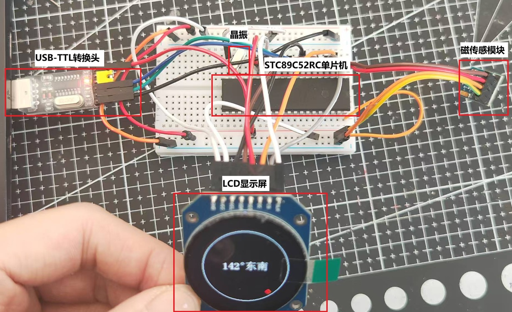  
/*这是最终成果图，主要元器件包括：51单片机，LCD显示屏，磁传感器模块，晶振，USB-TTL转换头*/

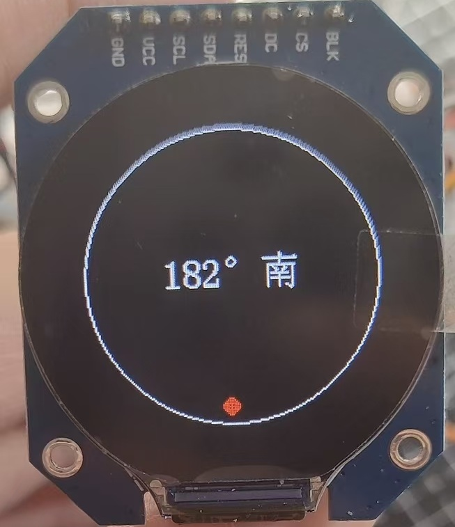  
/*倒三角是目前的正前方，红点代表正北方向，文字显示正前方和正北方向的夹角（1.28英寸屏幕无倒三角，且红点表示目前朝向）*/

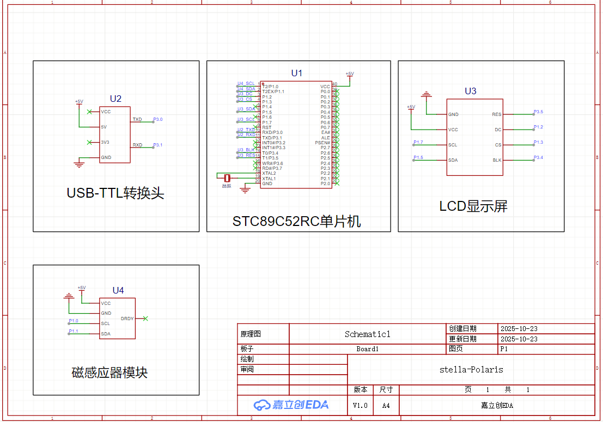 
/*这是整个插线板指南针的电路图*/

## 二、材料清单：

指南针元器件请参考

[0.96英寸屏幕版本材料清单](./材料旧.md)。

[1.28英寸屏幕版本材料清单](./材料新.md)。

注意：我们所用的芯片型号为QMC5883L，由于芯片停产，可能大家买到的标注为QMC5883L芯片实际上是QMC5883P芯片，故这里提供两款芯片的程序用P与L区分。磁传感器模组中的磁传感芯片（模块上最大的黑色方块）会写芯片型号，可以用放大镜查看，L芯片以HA开头，P芯片以HP开头。所用程序如下：

点击[下载（0.96英寸屏幕代码P）](./电子指南针旧p.hex)

点击[下载（1.28英寸屏幕代码P）](./电子指南针新p.hex)

点击[下载（0.96英寸屏幕代码L）](./电子指南针旧l.hex)

点击[下载（1.28英寸屏幕代码L）](./电子指南针新l.hex)

## 三、前驱知识——元器件与软件介绍：

### 1.晶振

晶振内置石英晶体片，利用其独特的压电效应工作，它会周期性振动，振动最终被转换为设备运行所需的、频率高度稳定的电信号。

### 2.传感器

磁力计传感器是整个系统的‘感知核心’。它如同项目的‘眼睛’，负责实时检测地球磁场的方向和强度，并将这些物理量转换为微弱的电信号，为后续计算方位提供最原始的数据基础。它主要提供X，Y，Z三个维度的数据。

### 3.显示屏

它将传感器采集并经由单片机处理后的地磁数据，​转换为直观、可视化的方向信息

### 4.杜邦线

杜邦线的端头有两种规格，公（尖）与母（孔），将元器件（杜邦线）的引脚尖端插入杜邦线（面包板）孔端即为连接。

### 5.转换头

USB转TTL转换头是一个小巧的电子适配器，它能将电脑USB接口的信号转换为单片机等嵌入式设备能识别的TTL电平串口信号，充当两者之间的通信桥梁

### 6.面包板

面包板分为电源区与主工作区（如左图），主工作区分左右两半互不相连，但每半扇工作区的每排引脚孔相连（如右图中红框选中的引脚孔，是横向相连的一组）。当不同元器件通过杜邦线插入同一半工作区的同一排引脚孔，视为相连。即：工作区横向相连，电源区纵向相连。  
    

### 7.单片机

单片机通过面包板与其余元器件相连接，此处介绍单片机引脚，以下是单片机的引脚示意图，用于后续单片机与其他元器件引脚连接时对照。左图是示意图，右图为实物图，注意半圆缺口方向向上。

  

### 8.stc-isp烧录软件

用于将代码从计算机烧录到单片机中。可以官网下载

---

## 四、指南针的安装与检验

### 1.最小系统电路板的安装

#### (1)放置单片机与连通面包板

将单片机放置于面包板上，两排引脚分别插入面包板左右工作区引脚孔中，位置尽量居中。注意：我们将单片机的第一行插入面包板所标注的1行，这样方便我们后续插入（如图所示）

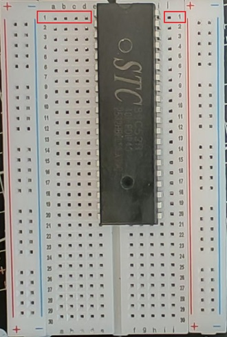

用两根杜邦线（公对公，或者用跳线）将左右的正级（+）与正极（+），负极（-）与负极（-）相连（连接左右的电源区）。

同上，用两根杜邦线（公对公，或者用跳线）连接单片机的VCC引脚与电源区正极、单片机VSS引脚与电源区负极

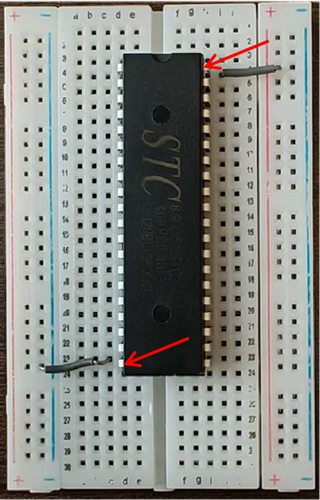 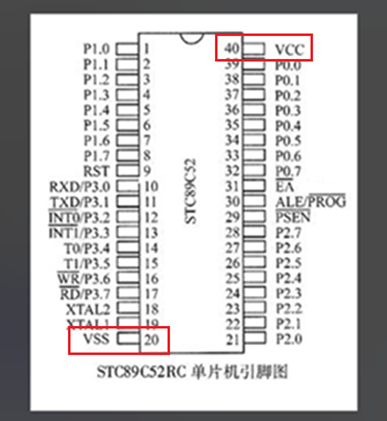

#### (2)连接晶振

晶振两个引脚没有方向区分，分别连接单片机的XTAL1、XTAL2引脚即可，此处无需使用杜邦线。以下是引脚连接表与实物示例图：

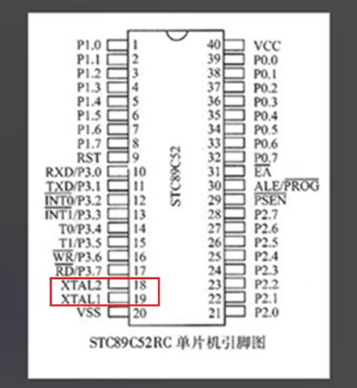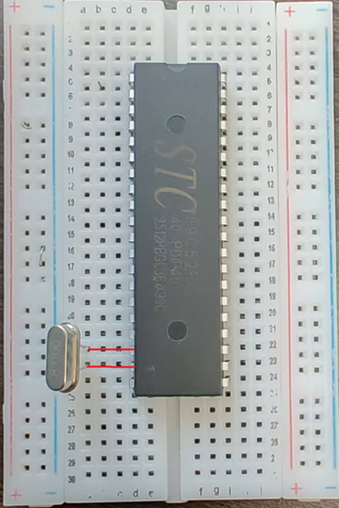

#### (3)连接转换器

TXD引脚负责输出数据，RXD引脚负责输入数据，故应将不同元器件的TXD与RXD相连。注意：该转换器有三个电源输出引脚，我们需要使用5v引脚。

以下是引脚连接表与示例图：

 |转换器引脚|单片机引脚/面包板|  
 |:---:|:---:|  
 5V|面包板正极  
 GND|面包板负极  
 TXD|RXD  
 RXD|TXD  

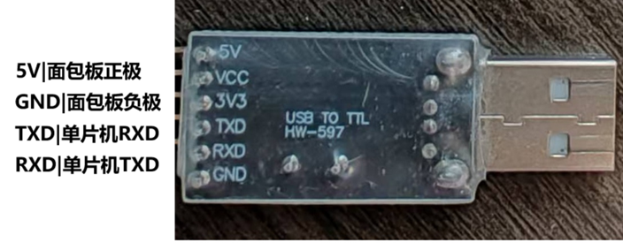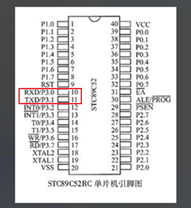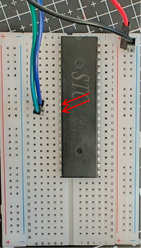

### 2.烧录程序与检验最小系统电路板

通过上述步骤，我们已经搭建了一个最小系统电路板，我们可以向单片机烧录程序，来验证我们的最小系统电路板是否搭建有误。只要程序成功烧录，即证明我们最小系统电路板搭建正确。以下是烧录步骤：

(1) 左键双击stc软件，弹框直接点确定。

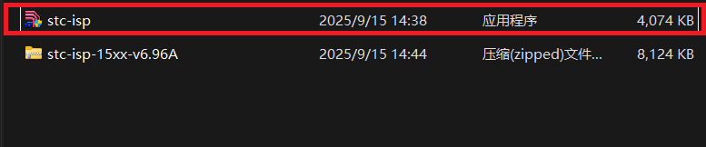

(2) 找到stc界面中的单片机型号一栏，在列表中选择STC89C52RC/LE52RC（选择自己单片机的型号，此处仅为展示）。此时将单片机上的转换器插入电脑USB接口，软件会自动选择串口号（如果未识别到串口号，说明你的电脑缺少ch340n的驱动）。

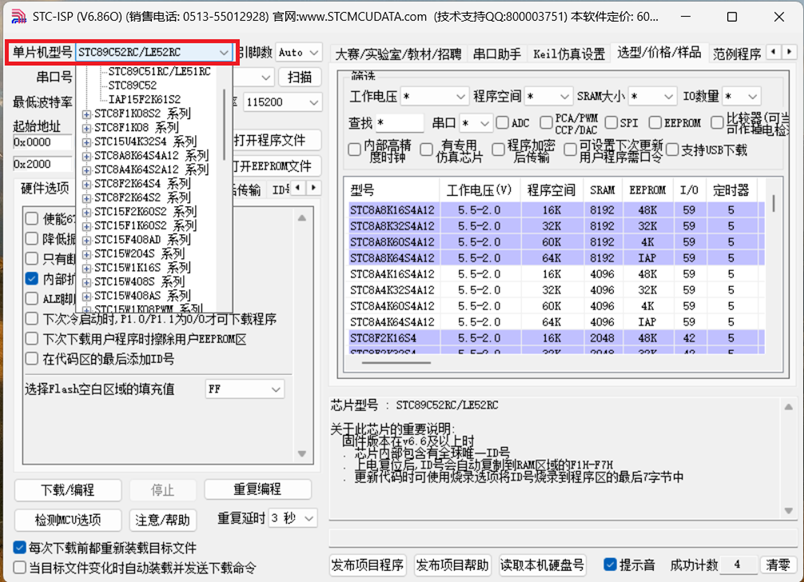

(3) 左键单击红框中的“打开程序文件”。

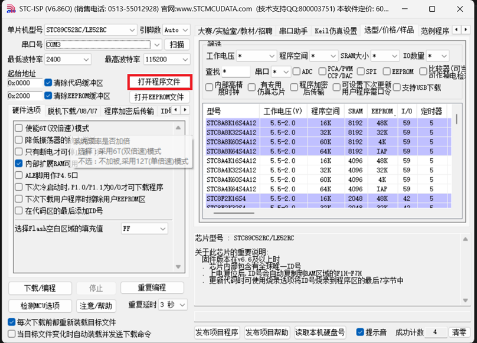

(4) 选择之前下载的hex格式文件。

(5) 左键单击下载。注意，单片机需要冷启动，将转换器的正极电源线从面包板上拔下再插入，然后程序才会开始烧录。

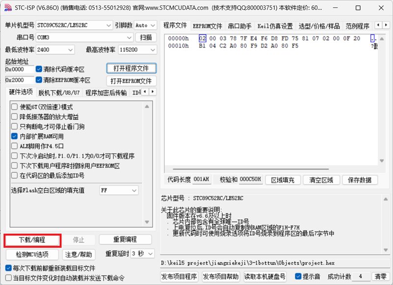

(6) 如果一直在查找单片机，请检查单片机型号与串口号是否正确，单片机是否冷启动

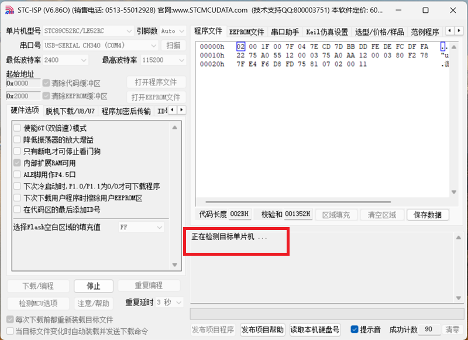

(7) 右下角如图所示代表程序烧录成功

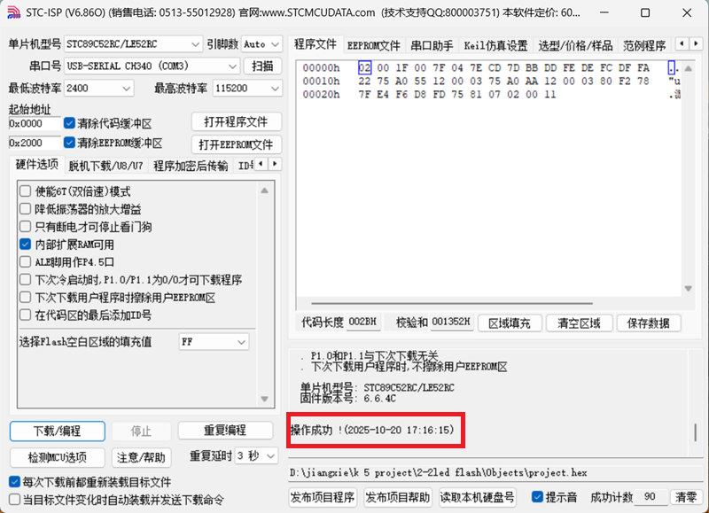

### 3.屏幕与磁传感的安置与检验

#### (1)显示屏安置与检测

此处先将显示屏与端子线连接（1.28英寸的屏幕无需连接端子线，使用杜邦线即可），注意按照图片中的方向连接。然后连接端子线另一端的八个尖头，以下是引脚连接表与示例图：

|显示器引脚|单片机引脚/面包板|
|:---:|:---:|
GND|面包板阴极
VCC|面包板阳极
SCL|P1.7
SDA|P1.5
RES|T1
DC|P1.2
CS|P1.3
BLK|T0

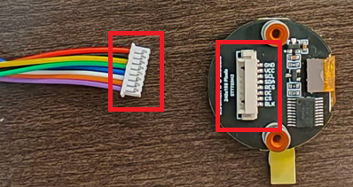

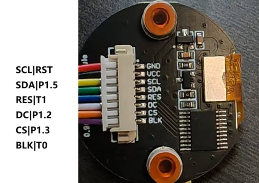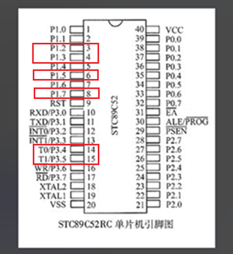

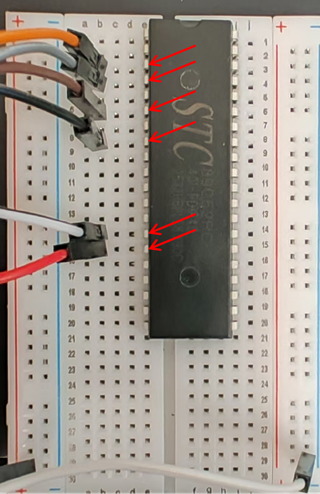

由于之前已经烧录过程序，此时接通电源，应该能看见“45° 东北”字样，此时证明屏幕连接正确。

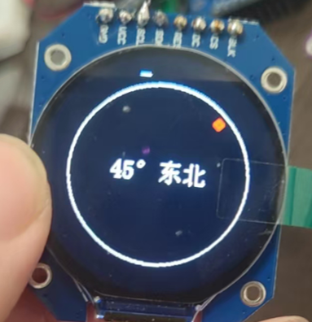

#### (2)磁传感器安置与检测
我们仅用到传感器上的VCC（电源），GND（地线），SCL（串行时钟线），SDA（串行数据线）这四个引脚。以下是引脚连接表与示例图（表中展示的同一行的两个引脚应该相连）：

|传感器引脚|单片机引脚/面包板|
|:---:|:---:|
VCC|面包板正极
GND|面包板负极
SCL|单片机P1.0
SDA|单片机P1.1

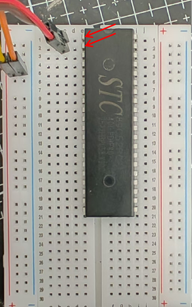

接通电源，屏幕上的方位如果能随着你的磁传感指向变动而变动，说明你的整个指南针电路搭建没问题。

---

> ## 至此，一个小型插线板指南针就已经制作完成了。动手实践是最好的学习，期待看到你用它创造出更多有趣的应用。

