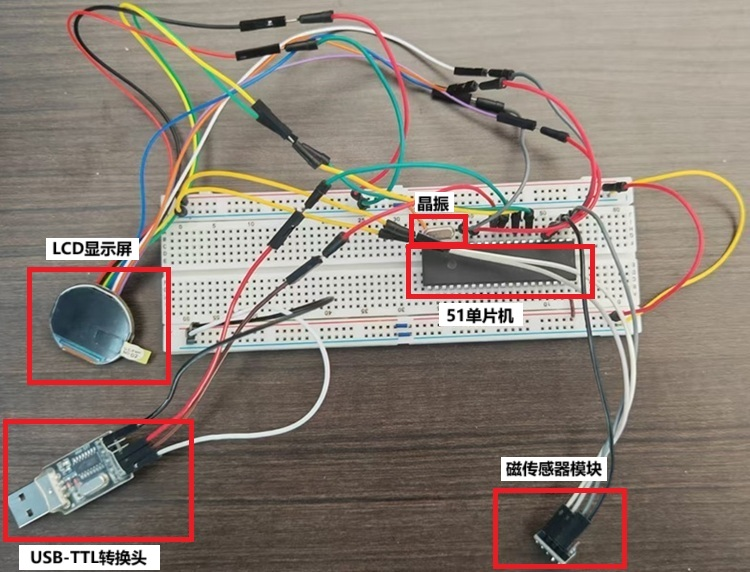
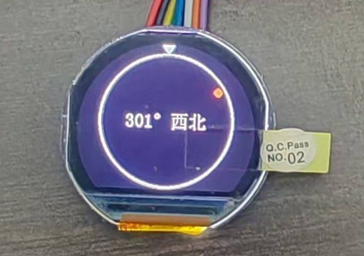
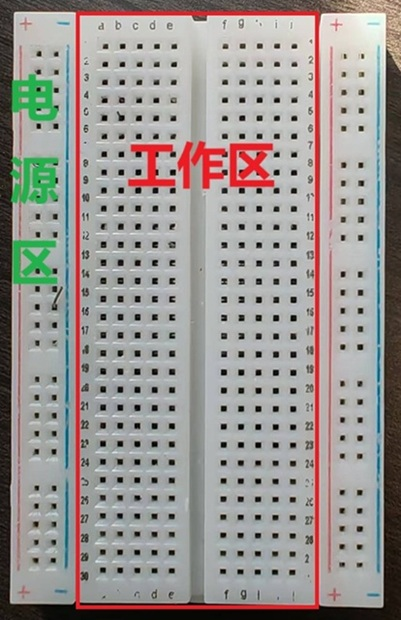
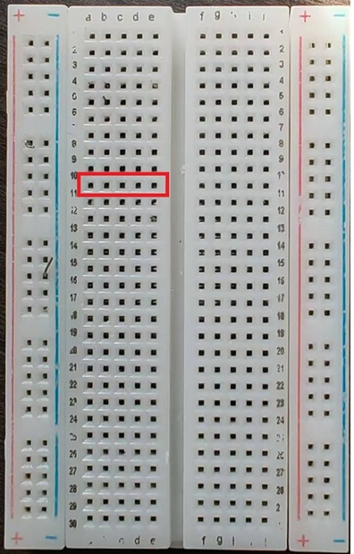
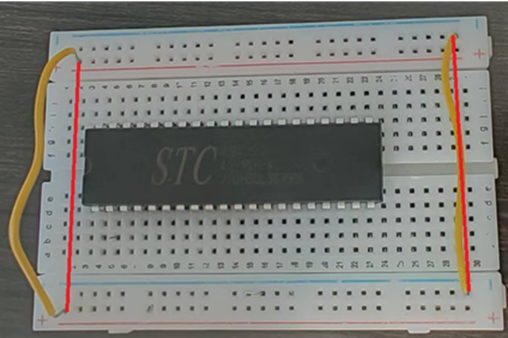
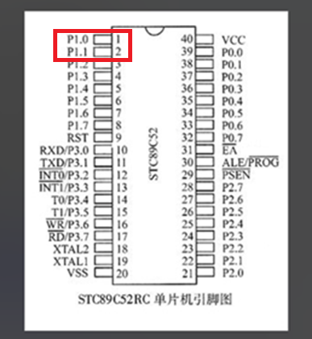
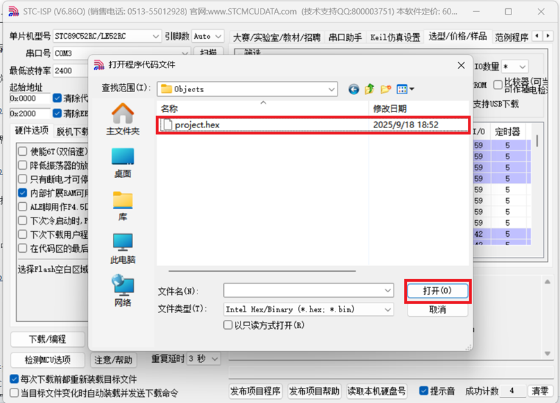

# 北极星--插线板指南针制作教程

>
---

## 目录

* [一、项目介绍](#一项目介绍)
* [二、材料清单](#二材料清单)
* [三、前驱知识——元器件介绍](#三前驱知识元器件介绍)
    * [1. 晶振](#1晶振)
    * [2. 传感器](#2传感器)
    * [3. 显示屏](#3显示屏)
    * [4. 杜邦线](#4杜邦线)
    * [5. 转换头](#5转换头)
    * [6. 面包板](#6面包板)
    * [7. 单片机](#6单片机)
* [四、指南针的硬件安装](#四指南针的硬件安装)
    * [1. 底座的处理](#1底座的处理)
    * [2. 元器件的安装](#2元器件的安装)
        * [(1) 连接数字罗盘传感器](#1放置数字罗盘传感器)
        * [(2) 连接LCD显示屏](#2连接lcd显示屏)
        * [(3) 连接晶振](#3连接晶振)
        * [(4) 连接转换器](#4连接转换器)
* [五、程序烧录](#五程序烧录)
    * [软件下载](#软件下载)
    * [程序下载](#程序下载)
    * [开始烧录](#开始烧录)

## 一、项目介绍

本教程旨在教会你完成一个简单的的电子指南针。它通过磁传感器模块实时检测地球磁场并计算方向发送给51单片机，再由51单片机将角度与方位信息画在LCD屏幕上。本指南针需要把USB-TTL转换头插在电脑上（或者其他5V电源）供电。

  
/*这是最终成果图，主要元器件包括：51单片机，LCD显示屏，磁传感器模块，晶振，USB-TTL转换头*/

  
/*倒三角是目前的正前方，红点代表正北方向，文字显示正前方和正北方向的夹角*/

## 二、材料清单：

指南针元器件请参考[材料清单](./材料.pdf)。

## 三、前驱知识——元器件介绍：

### 1.晶振

晶振内置石英晶体片，利用其独特的压电效应工作，它会周期性振动，振动最终被转换为设备运行所需的、频率高度稳定的电信号。

### 2.传感器

磁力计传感器是整个系统的‘感知核心’。它如同项目的‘眼睛’，负责实时检测地球磁场的方向和强度，并将这些物理量转换为微弱的电信号，为后续计算方位提供最原始的数据基础。它主要提供X，Y，Z三个维度的数据。

### 3.显示屏

它将传感器采集并经由单片机处理后的地磁数据，​转换为直观、可视化的方向信息

### 4.杜邦线

杜邦线的端头有两种规格，公（尖）与母（孔），将元器件（杜邦线）的引脚尖端插入杜邦线（面包板）孔端即为连接。

### 5.转换头

USB转TTL转换头是一个小巧的电子适配器，它能将电脑USB接口的信号转换为单片机等嵌入式设备能识别的TTL电平串口信号，充当两者之间的通信桥梁

### 6.面包板

面包板分为电源区与主工作区（如左图），主工作区分左右两半互不相连，但每半扇工作区的每排引脚孔相连（如右图中红框选中的引脚孔，是横向相连的一组）。当不同元器件通过杜邦线插入同一半工作区的同一排引脚孔，视为相连。即：工作区横向相连，电源区纵向相连。  
    

### 7.单片机

单片机通过面包板与其余元器件相连接，此处介绍单片机引脚，以下是单片机的引脚示意图，用于后续单片机与其他元器件引脚连接时对照。左图是示意图，右图为实物图，注意半圆缺口方向向上。

  

---

## 四、指南针的硬件安装

### 1.底座的处理

将单片机放置于面板板上，引脚插入面包板的引脚孔中，位置尽量居中

用两根杜邦线（两端为尖）将左右的正级与正极，负极与负极相连（连接左右的电源区）。如红线所示

连接单片机的VCC引脚与电源区正极、单片机VSS引脚与电源区负极

 

### 2.元器件的安装

#### (1)连接数字罗盘传感器
我们仅用到传感器上的VCC（电源），GND（地线），SCL（串行时钟线），SDA（串行数据线）这四个引脚。以下是引脚连接表与示例图（表中展示的同一行的两个引脚应该相连）：

|传感器引脚|单片机引脚/面包板|
|:---:|:---:|
VCC|面包板正极
GND|面包板负极
SCL|单片机P1.0
SDA|单片机P1.1

#### (2)连接LCD显示屏

此处先将显示屏与端子线连接，注意按照图片中的方向连接。然后连接端子线另一端的八个尖头，以下是引脚连接表与示例图：

|显示器引脚|单片机引脚/面包板|
|:---:|:---:|
GND|面包板阴极
VCC|面包板阳极
SCL|P1.7
SDA|P1.5
RES|T1
DC|P1.2
CS|P1.3
BLK|T0

#### (3)连接晶振

晶振两个引脚没有方向区分，分别连接单片机的XTAL1、XTAL2引脚即可，此处无需使用杜邦线。以下是引脚连接表与实物示例图：

#### (4)连接转换器

TXD引脚负责输出数据，RXD引脚负责输入数据，故应将不同元器件的TXD与RXD相连。以下是引脚连接表与示例图：

 |转换器引脚|单片机引脚/面包板|  
 |:---:|:---:|  
 VCC|面包板正极  
 GND|面包板负极  
 TXD|RXD  
 RXD|TXD  

---

## 五、程序烧录

### 软件下载

烧录需要用到stc-isp软件，自行官网下载。

### 程序下载

点击[下载](./电子指南针.hex)

### 开始烧录

(1) 点击stc软件，弹框直接点确定。此时将单片机上的转换器插入电脑USB接口。

(2) 点击stc界面中的单片机型号，在列表中找到STC89C52RC/LE52RC（选择自己单片机的型号，此处仅为展示），软件会自动选择串口号。

(3) 点击红框中的“打开程序文件”。

(4) 选择之前下载的hex文件，然后点击打开。

(5) 点击下载。注意，单片机需要冷启动，将转换器的正极电源线从面包板上拔下再插入，然后程序才会开始烧录。

(6) 如果一直在查找单片机，请检查单片机型号与串口号是否正确，单片机是否冷启动

(7) 右下角如图所示代表程序烧录成功

> ## 至此，一个小型插线板指南针就已经制作完成了。动手实践是最好的学习，期待看到你用它创造出更多有趣的应用。

