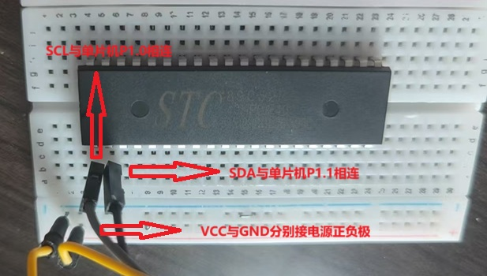
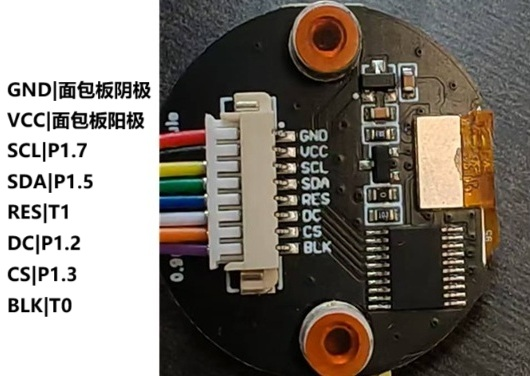
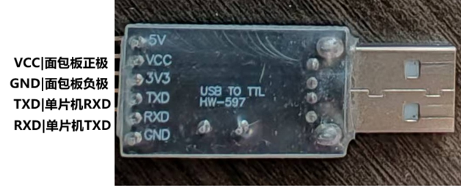

# 燕之波--插线板指南针制作教程

>本教程将指导你如何利用简单材料制作一个简易的插线板指南针。
---

## 目录

- [说明](#说明)
  - [注意事项](#注意事项)
  - [单片机引脚示意图](#单片机引脚示意图)
- [指南针的硬件安装](#指南针的硬件安装)
  - [底座的处理](#底座的处理)
  - [元器件的安装](#元器件的安装)
- [程序烧录](#程序烧录)
  - [软件下载](#软件下载)
  - [程序下载](#程序下载)
  - [开始烧录](#开始烧录)

## 说明：

### 注意事项

- 指南针元器件请参考[材料清单](./材料.md)。
- 杜邦线的端头有两种规格，尖与孔，将元器件的引脚尖端插入杜邦线孔端即可连接。
- 杜邦线插入面包板时，可能有接触不良的现象，可以选择在插入的引脚孔中插入一根短的铁丝，增加接触面积
- 单片机通过面包板与其余元器件相连接，面包板分为电源区与主工作区（如左图），主工作区分左右两半互不相连，但每半扇工作区的每排引脚孔相连（如右图中红框选中的引脚孔）。当不同元器件通过杜邦线插入同一半工作区的同一排引脚孔，视为相连。即：工作区横向相连，电源区纵向相连。  
    

### 单片机引脚示意图

 - 用于后续单片机与其他元器件引脚连接时对照。左图是示意图，右图为实物图，注意半圆缺口方向向上。
   
  
  
## 指南针的硬件安装

### 底座的处理

- 将单片机放置于面板板上，引脚插入面包板的引脚孔中，位置尽量居中

- 由于面包板左右电极不互通，而我们只给一侧接通电源，故用两根杜邦线（两端为尖）将左右的正级与正极，负极与负极相连。如红线所示

- 连接单片机的VCC引脚与电源区正极、单片机VSS引脚与电源区负极
  
 

### 元器件的安装

- 首先放置数字罗盘传感器，传感器内部有磁阻元件，能测量三个维度（X、Y、Z轴）的磁场强度，并将这些物理量转换为电信号。我们需要用到传感器上的VCC（电源），GND（地线），SCL（串行时钟线），SDA（串行数据线）这四个引脚。以下是引脚连接表与示例图（表中展示的同一行的两个引脚应该相连）：
   
|传感器引脚|单片机引脚/面包板|
|:---:|:---:|
VCC|面包板正极
GND|面包板负极
SCL|单片机P1.0
SDA|单片机P1.1

   

- 接下来连接LED显示屏，主要用于显示传感器所指向的方位，并以数字显示。此处需要连接8个引脚（如果一个元器件的两个引脚与另一元器件的一个引脚相连，只要将这三个引脚连在面包板同一工作区的同一排即可），以下是引脚连接表与示例图：
   
|显示器引脚|单片机引脚/面包板|
|:---:|:---:|
GND|面包板阴极
VCC|面包板阳极
SCL|P1.7
SDA|P1.5
RES|T1
DC|P1.2
CS|P1.3
BLK|T0

- 连接晶振，晶振主要为单片机提供时钟信号。晶振两个引脚没有方向区分，分别连接单片机的XTAL1、XTAL2引脚即可，此处无需使用杜邦线。以下是引脚连接表与实物示例图：

- 连接转换器，USB与TTL接口的信号转换。TXD是输出数据，RXD是输入数据，故应将不同元器件的TXD与RXD相连。以下是引脚连接表与示例图：

 |转换器引脚|单片机引脚/面包板|  
 |:---:|:---:|  
 VCC|面包板正极  
 GND|面包板负极  
 TXD|RXD  
 RXD|TXD  

   

- 放置电阻，用于拉高电平。电阻无方向，但其中引脚应如图所示，以达成拉高电平的目的。以下是引脚连接表与示例图：

 |电阻引脚|单片机引脚|  
 |:---:|:---:| 
 电阻A任意引脚|面包板正极
 电阻A另一引脚|P1.0
 电阻B任意引脚|面包板正极
 电阻B另一引脚|P1.1
 

---

## 程序烧录

### 软件下载

烧录需要用到stc-isp软件，自行官网下载。

### 程序下载

- [ ] 点击[下载](./电子指南针.hex)

### 开始烧录

- 点击stc软件。
   

- 点击stc界面中的单片机型号，在列表中找到STC89C52RC/LE52RC（选择自己单片机的型号，此处仅为展示）。

- 将连接转换器插入电脑USB接口，软件会自动选择串口号，如果报错，查看是否单片机型号选择错误。

- 点击红框中的“打开程序文件”。

- 选择之前下载的hex文件，然后点击打开。

- 点击下载。注意，单片机需要冷启动，即断开电源再连接。

> ## 至此，一个小型插线板指南针就已经制作完成了。动手实践是最好的学习，期待看到你用它创造出更多有趣的应用。

