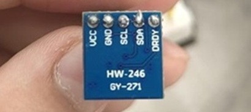

|元器件|规格|数量| |
|:---|:---:|---:|:---:|
单片机|SRC89C52RC|一个||
LCD显示屏|ST7789H2 0.96寸ips全视角TFT显示屏SPI串口|一块||
数字罗盘传感模块|HW-246/GY-271|一个||
杜邦线|5-10cm|八根母对公，十二根公对公||
面包板|400孔|一个||
USB to TTL转换头|HW-597|一个||
晶振|8kHZ|一个||
端子连接线|1.25mm间距，8p|一根||
