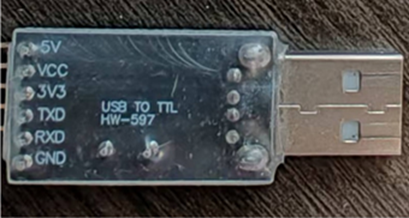

|元器件|规格|数量| |
|:---|:---:|---:|:---:|
STC89C52RC单片机（简称单片机）|STC89C52RC|一个||
LCD显示屏（简称屏幕）|金逸晨1.28寸TFT液晶屏GC9A01小屏幕240x240显示器LCD圆屏SPI彩屏|一块||
数字罗盘传感模块（简称磁传感器）|HW-246/GY-271 芯片QMC358883L|一个||
杜邦线|10cm|十六根公对母，四根公对公/或者二十根公对公和二十根母对母||
面包板|400孔|一个||
USB to TTL转换头（简称转换头）|HW-597|一个||
晶振|8.000MHZ|一个||
